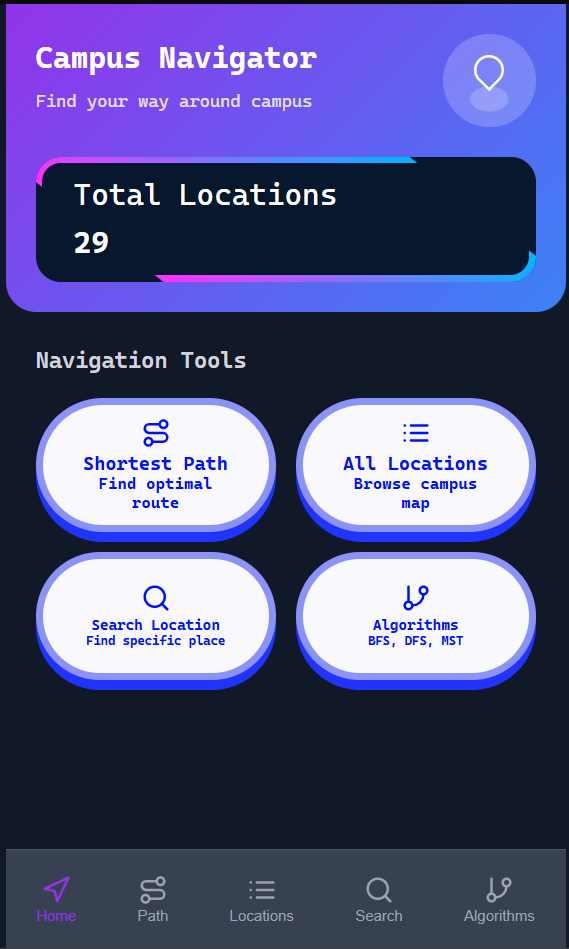
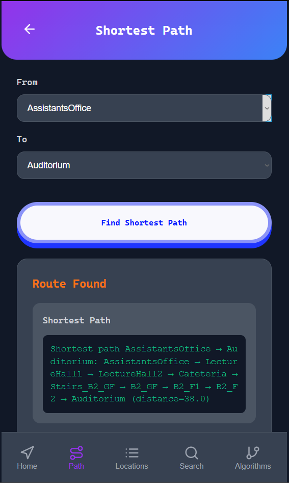
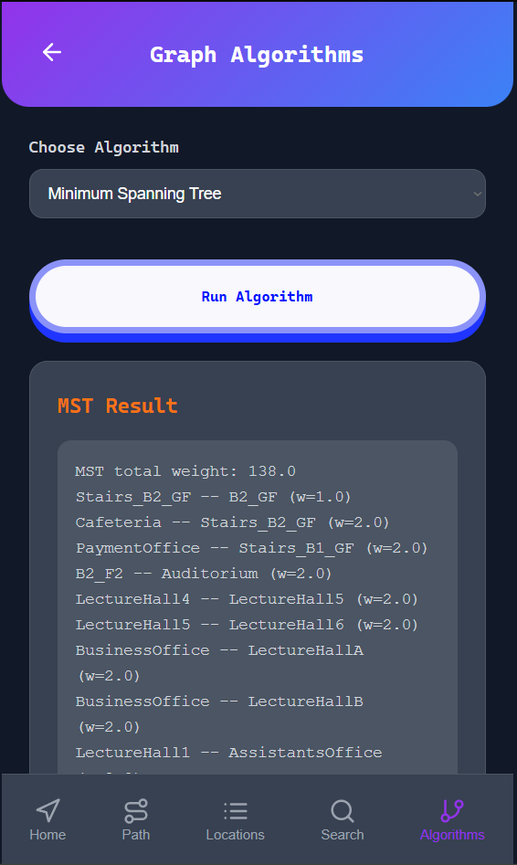

# Campus Navigator

Campus Navigator is a graph-based navigation tool designed to help users find the most efficient routes between locations on a university campus. Developed as part of the Higher National Diploma in Software Engineering at NIBM, this project showcases the practical use of data structures and algorithms in solving real-world spatial problems.

---

## Screenshots

- 
- 
- 

---

## Features

- **Shortest Path Finder** using Dijkstra’s Algorithm
- **Minimum Spanning Tree (MST)** via Kruskal’s Algorithm
- **Graph Traversal** with BFS and DFS
- **Location Search** using Binary Search Tree (BST)
- Internal use of Queue (FIFO) and Stack (LIFO) for traversal operations

---

## Algorithms Explained

### 1. Dijkstra’s Algorithm

- **Purpose**: Finds the shortest path between two locations.
- **Use Case**: Helps users navigate efficiently across campus.
- **How It Works**: Calculates the minimum cost from a starting node to all other nodes using a priority queue.

### 2. Kruskal’s Algorithm

- **Purpose**: Generates a Minimum Spanning Tree.
- **Use Case**: Visualizes the most efficient way to connect all campus locations with minimal total distance.
- **How It Works**: Sorts all edges by weight and adds them to the MST if they don’t form a cycle.

### 3. Breadth-First Search (BFS)

- **Purpose**: Explores all nodes level by level.
- **Use Case**: Useful for finding the shortest unweighted path or checking connectivity.
- **How It Works**: Uses a queue to visit nodes in layers.

### 4. Depth-First Search (DFS)

- **Purpose**: Explores as far as possible along each branch before backtracking.
- **Use Case**: Useful for route exploration and cycle detection.
- **How It Works**: Uses a stack or recursion to dive deep into the graph.

### 5. Binary Search Tree (BST)

- **Purpose**: Efficient location search.
- **Use Case**: Quickly find if a building or location exists in the system.
- **How It Works**: Organizes locations in a tree structure for fast lookup.

---

## Technologies Used

- **Language**: Python, Html, Css, JavaScript
- **Libraries**: Heapq, Deque, Dataclass, Dict, List, Optional, Tuple
- **Concepts**: Graph Theory, Data Structures, Algorithms

---

## Customization

This tool is designed to be adaptable for **any university campus**. To use it for your own institution:

1. Open the backend graph definition file (e.g., `campus_navigator_backend.py`).
2. Replace the existing nodes and edges with your campus layout:
   ```python
   graph = {
       'Library': {'Cafeteria': 5, 'Admin': 3},
       'Cafeteria': {'Library': 5, 'Gym': 2},
       ...
   }
   ```
